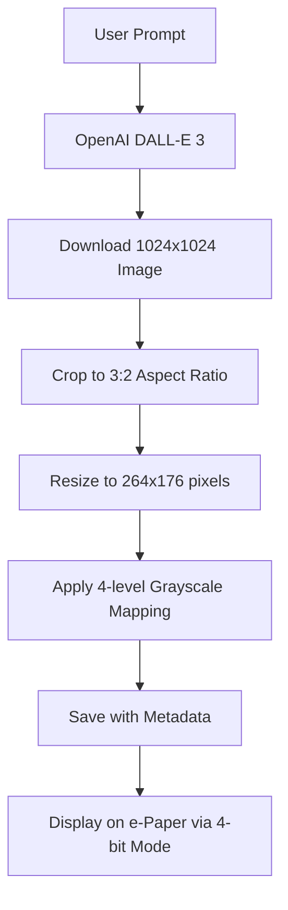

# E-Paper Display Control System

## Project Overview
This project creates a comprehensive Flask web application to remotely control a Waveshare 2.7" e-Paper display connected to a Raspberry Pi. The system provides a complete digital art and content management platform featuring:

- **AI Image Generation**: Create custom images using OpenAI DALL-E 3 from any text prompt
- **Image Gallery Management**: Browse, display, and manage 185+ AI-generated images with custom descriptions
- **Display Control**: Show text, patterns, time, and various content on the e-Paper screen
- **Interactive Applications**: Harry Potter quiz with AI-generated imagery
- **Web-based Interface**: Complete control through an intuitive web UI accessible from any device

The system combines the unique aesthetic of e-Paper displays with modern AI image generation capabilities, creating a one-of-a-kind artistic display platform.

## Hardware Setup
- **Device**: Raspberry Pi 3B
- **Display**: Waveshare 2.7" 4-bit grayscale e-Paper display (epd2in7_V2)
- **Network**: WiFi connected at 192.168.0.9
- **GPIO**: Uses GPIO pins for SPI communication with the display

## Project Structure

### Raspberry Pi Directory Structure
```
/home/pi/eink_os/
├── app.py                          # Basic Flask app
├── app_4bit.py                     # 4-bit grayscale Flask app (has display issues)
├── app_1bit_working.py             # ✅ FULL-FEATURED Flask app (RECOMMENDED)
│                                   # - AI image generation with DALL-E 3
│                                   # - Image gallery with 185+ images and descriptions  
│                                   # - 1-bit B&W + 4-bit grayscale support
│                                   # - Complete web interface
├── app_enhanced.py                 # Enhanced Flask app with web UI
├── app_safe.py                     # Safe version with error handling
├── harrypotter_quiz.py             # Original quiz wrapper
├── harrypotter_quiz_portable.py    # Portable version with dynamic paths
├── harrypotter_quiz_standalone.py  # Standalone version with venv
├── hp_quiz_launcher.py             # Launcher script
├── start_server.sh                 # Server startup script
├── flask.log                       # Flask application logs
└── templates/
    ├── index.html                  # Main web interface
    └── debug.html                  # Debug interface

/home/pi/e-Paper/RaspberryPi_JetsonNano/python/
├── lib/                            # Waveshare EPD library
│   └── waveshare_epd/
├── examples/                       # Original examples and dependencies
│   ├── harrypotter_quiz.py         # Original Harry Potter quiz
│   ├── helper_quiz.py               # Quiz helper functions
│   ├── image_generator.py           # AI image generation
│   ├── testenv/                     # Virtual environment
│   └── .env                        # Environment variables (OpenAI key)
└── pic/                            # Image assets

/home/pi/rpi-screen/
├── images/                         # ✨ AI Image Gallery (185+ images)
│   ├── ai_hp_*_resized.bmp        # Harry Potter themed AI images (62)  
│   ├── ai_custom_*_resized.bmp    # Custom user-generated AI images
│   └── *.bmp                      # Original and processed image files
└── image_metadata.json            # Image descriptions and prompts
```

## Key Components

### 1. Flask Web Application (`app_1bit_working.py` - FULL-FEATURED)
- **Framework**: Flask web server with comprehensive features
- **Port**: 5000 (accessible at http://192.168.0.9:5000)  
- **Display Modes**: 1-bit B&W (text/patterns) + 4-bit grayscale (images)
- **🎨 AI Features**:
  - **OpenAI DALL-E 3 Integration**: Generate custom images from text prompts
  - **Complete Processing Pipeline**: Auto-crop, resize, and optimize for e-Paper
  - **Dual Generation Modes**: Generate & Display instantly, or Save to Gallery
- **🖼️ Image Gallery**:
  - **185+ AI Images**: Browse Harry Potter + custom generated artwork
  - **Smart Descriptions**: Auto-generated or custom image descriptions  
  - **Metadata Management**: JSON-based storage with persistent descriptions
- **💻 Web Interface**:
  - **Intuitive Design**: Modern, responsive web UI with real-time feedback
  - **Complete Control**: Display text, images, patterns, time, and manage gallery
  - **Error Handling**: Robust validation and user-friendly error messages

### 2. Core Display Functions
- **Clear Display**: `/clear` - Clears the e-Paper screen
- **Test Pattern**: `/test` - Displays geometric shapes and lines (1-bit B&W)
- **Hello World**: `/hello` - Shows greeting text (1-bit B&W)
- **Current Time**: `/time` - Displays current date and time (1-bit B&W)
- **Custom Text**: `/text` (POST) - Shows user-provided text with word wrapping (1-bit B&W)
- **Sleep/Wake**: `/sleep`, `/wake` - Power management

### 3. 🎨 AI Image Generation & Gallery
- **Generate Custom Images**: `/generate_image` (POST) - Create and display from text prompt
- **Generate to Gallery**: `/generate_image_only` (POST) - Create and save to gallery  
- **Browse Gallery**: `/images/list` - View all 185+ images with descriptions
- **Display Image**: `/images/display` (POST) - Show specific image from gallery
- **Random Image**: `/images/random` - Display random image from collection
- **Edit Descriptions**: `/images/update_description` (POST) - Customize image descriptions
- **Harry Potter Quiz**: `/quiz/start` - Interactive quiz with AI-generated images (4-bit grayscale)

### 4. Path Resolution System
The project uses dynamic path resolution to work from any location:
```python
epaper_root = '/home/pi/e-Paper/RaspberryPi_JetsonNano/python'
libdir = os.path.join(epaper_root, 'lib')
examplesdir = os.path.join(epaper_root, 'examples')
```

### 5. Virtual Environment Integration
- **Location**: `/home/pi/e-Paper/RaspberryPi_JetsonNano/python/examples/testenv/`
- **Dependencies**: Flask, OpenAI, PIL, python-dotenv
- **Activation**: Handled automatically by shebang or startup scripts

## API Endpoints

### Core Display Endpoints (GET)
- `GET /` - Main web interface with full feature access
- `GET /clear` - Clear display (1-bit B&W)
- `GET /test` - Show test pattern (1-bit B&W)
- `GET /hello` - Display "Hello World" (1-bit B&W)
- `GET /time` - Show current date and time (1-bit B&W)
- `GET /sleep` - Put display to sleep
- `GET /wake` - Wake display from sleep

### 🖼️ Image Gallery Endpoints (GET)
- `GET /images/list` - List all images with descriptions and metadata
- `GET /images/random` - Display random image from gallery (4-bit grayscale)
- `GET /quiz/start` - Start Harry Potter quiz (4-bit grayscale images)

### Core Display Endpoints (POST)
- `POST /text` - Display custom text (1-bit B&W)
  ```json
  {
    "text": "Your custom message here"
  }
  ```

### 🎨 AI Image Generation Endpoints (POST)
- `POST /generate_image` - Generate and display custom image
  ```json
  {
    "prompt": "A magical forest with glowing mushrooms"
  }
  ```
  Response: `{"status": "success", "message": "Generated and displayed: ...", "filename": "..."}`

- `POST /generate_image_only` - Generate image and save to gallery only
  ```json
  {
    "prompt": "A serene mountain landscape with a lake"
  }
  ```

### 🖼️ Image Management Endpoints (POST)
- `POST /images/display` - Display specific image from gallery
  ```json
  {
    "filename": "ai_custom_20250805_184711_resized.bmp"
  }
  ```

- `POST /images/update_description` - Update image description
  ```json
  {
    "filename": "ai_custom_20250805_184711_resized.bmp",
    "description": "Beautiful sunset over magical castle with dragons"
  }
  ```

## Usage Instructions

### Starting the Server
```bash
# SSH into Raspberry Pi
ssh -i "C:\Users\tuan\.ssh\id_rsa_pi3b" pi@192.168.0.9

# Navigate to project directory
cd /home/pi/eink_os

# Start WORKING server (RECOMMENDED)
/home/pi/e-Paper/RaspberryPi_JetsonNano/python/examples/testenv/bin/python app_1bit_working.py

# Or start in background
/home/pi/e-Paper/RaspberryPi_JetsonNano/python/examples/testenv/bin/python app_1bit_working.py > flask.log 2>&1 &

# Legacy start server script (may not work due to display issues)
./start_server.sh
```

### Accessing the Web Interface
1. **Open Web Browser** and navigate to: `http://192.168.0.9:5000`
2. **🎨 AI Image Generator**: 
   - Enter any prompt: *"A serene mountain landscape with a lake"*
   - Click **"Generate & Display"** to see it immediately (~25 seconds)
   - OR click **"Generate Only"** to save to gallery (~15 seconds)
3. **🖼️ Image Gallery**:
   - Click **"Browse Gallery"** to see 185+ AI images with descriptions
   - Click any image's **"Display"** button to show it on e-Paper
   - Click **"Edit"** to customize descriptions
   - Click **"Random Image"** for instant art
4. **Basic Controls**: Clear, Test Pattern, Hello World, Show Time
5. **Custom Text**: Enter text for display with automatic word wrapping

### Monitoring Logs
```bash
# View logs in real-time
tail -f /home/pi/eink_os/flask.log

# View recent logs
tail -20 /home/pi/eink_os/flask.log
```

### Running Harry Potter Quiz Standalone
```bash
# From anywhere on the Pi
/home/pi/eink_os/harrypotter_quiz_standalone.py

# Or using launcher
/home/pi/eink_os/hp_quiz_launcher.py
```

## Technical Details

### Display Specifications
- **Model**: Waveshare 2.7" e-Paper Display (epd2in7_V2)
- **Resolution**: 264x176 pixels
- **Colors**: 4-bit grayscale (16 levels of gray) - **SEE CRITICAL FINDINGS BELOW**
- **Interface**: SPI communication via GPIO
- **Refresh Time**: 4-15 seconds for full refresh
- **Power Consumption**: Very low (μA in sleep mode)
- **Viewing Angle**: Nearly 180° (paper-like)
- **Update Mechanism**: Electrophoretic display technology

### ⚠️ CRITICAL FINDINGS - Display Mode Compatibility

**IMPORTANT DISCOVERY**: This specific Waveshare 2.7" display hardware has limited 4-bit grayscale support:

**✅ What Works:**
- **1-bit Black & White Mode**: `epd.display(epd.getbuffer(image))` with `Image.new('1', ...)` - **FULLY FUNCTIONAL**
  - Perfect for: Text, patterns, simple graphics, UI elements
- **4-bit Grayscale with Pre-made/Processed Bitmaps**: `epd.display_4Gray()` - **WORKS PERFECTLY**
  - ✅ AI-generated images (DALL-E processed through pipeline)
  - ✅ Harry Potter quiz images  
  - ✅ Gallery images (185+ working examples)
  - ✅ Any bitmap processed through crop → resize → 4-level mapping
- **Clear Function**: `epd.Clear()` - Always works

**❌ What Doesn't Work:**
- **4-bit Grayscale with Direct Programmatic Drawing**: `epd.display_4Gray()` with freshly created `Image.new('L', ...)`
  - API calls return success but nothing displays visually
  - Affects: Test patterns, text, shapes drawn directly with PIL/ImageDraw
  - **Solution**: Use 1-bit mode for programmatic content, 4-bit for processed images

**Root Cause Analysis:**
1. **Hardware/Firmware Limitation**: The display controller doesn't properly render programmatically created 4-bit grayscale images
2. **Processed Bitmaps Work**: Pre-made or AI-generated images work because they go through proper conversion pipeline
3. **Silent Failure**: The Waveshare library reports success even when programmatic display operations fail
4. **Pipeline Success**: AI generation pipeline (crop → resize → 4-level mapping) produces compatible bitmaps

**💡 BREAKTHROUGH SOLUTION:**
- **Hybrid Approach**: `app_1bit_working.py` uses both modes optimally
  - **1-bit B&W**: Text, patterns, UI elements, programmatic content
  - **4-bit Grayscale**: AI-generated images, gallery images, processed bitmaps
- **185+ Working Examples**: Proves 4-bit mode works with proper image processing
- **Complete Functionality**: All features work with appropriate mode selection

## 🎨 AI Image Generation Workflow

### Complete Processing Pipeline
The system uses a sophisticated pipeline to generate, process, and display AI images:



### Key Processing Steps
1. **DALL-E 3 Generation**: Creates high-quality 1024x1024 images (~13 seconds)
2. **Smart Cropping**: Maintains aspect ratio for optimal e-Paper display
3. **Precise Resizing**: Matches exact e-Paper dimensions (264x176)
4. **Grayscale Mapping**: Converts to 4-level grayscale (0, 85, 170, 255) for hardware compatibility
5. **Metadata Storage**: User prompts stored as descriptions for perfect context
6. **Gallery Integration**: New images automatically appear in browseable gallery

### Timing Performance
- **Generate Only**: ~15 seconds (DALL-E + processing)
- **Generate & Display**: ~25 seconds (generation + e-Paper refresh)
- **Gallery Display**: ~10 seconds (pre-processed images)

### Example Workflow
```bash
# User enters: "A magical forest with glowing mushrooms"
POST /generate_image {"prompt": "A magical forest with glowing mushrooms"}

# System executes:
1. OpenAI API call (13s)
2. Image processing (1s)  
3. e-Paper display (10s)
4. Gallery update (instant)

# Result: Beautiful grayscale image on display + saved to gallery with description
```

### Critical Implementation Notes

**Display Driver Functions:**
- **Standard Display**: `epd.display(epd.getbuffer(image))` - For 1-bit images
- **4-bit Grayscale**: `epd.display_4Gray(epd.getbuffer_4Gray(image))` - For grayscale images
- **Clear Function**: `epd.Clear()` - Clears to white/blank
- **Initialization**: `epd.init()` - Must call before operations
- **Sleep Mode**: `epd.sleep()` - Low power mode

**Image Creation:**
```python
# For grayscale images
image = Image.new('L', (epd.width, epd.height), 255)  # L=grayscale, 255=white
draw = ImageDraw.Draw(image)
draw.rectangle((x, y, x2, y2), fill=128)  # 128 = medium gray
epd.display_4Gray(epd.getbuffer_4Gray(image))
```

**GPIO Pin Usage:**
- Uses SPI interface (MOSI, MISO, CLK, CS)
- Additional control pins for reset, data/command, busy status
- Shared with other SPI devices - avoid conflicts

### Libraries Used
- **Flask**: Web framework
- **Pillow (PIL)**: Image processing
- **waveshare_epd**: E-Paper display driver
- **OpenAI**: AI image generation (for quiz)
- **gpiozero**: GPIO control

### Error Handling
- GPIO busy detection
- Display initialization failures
- Network connectivity issues
- Font loading fallbacks
- Text wrapping for long messages

## Troubleshooting

### Common Issues

1. **GPIO Busy Error**
   ```
   lgpio.error: 'GPIO busy'
   ```
   - **Solution**: Kill existing processes using GPIO or reboot Pi
   - **Cause**: Multiple processes trying to use the same GPIO pins
   - **Check**: `ps aux | grep python` to find conflicting processes

2. **Display Not Responding**
   - Check GPIO connections
   - Verify SPI is enabled: `sudo raspi-config`
   - Test with original Waveshare examples

3. **Web Interface Not Accessible**
   - Verify server is running: `ss -tlnp | grep :5000`
   - Check network connectivity
   - Try SSH tunnel: `ssh -L 8080:localhost:5000 pi@192.168.0.9`

4. **Buttons Appear Not Working**
   - **IMPORTANT**: E-Paper displays are VERY SLOW (4-15 seconds to update)
   - Wait for response - the display shows "e-Paper busy" during updates
   - Check browser console for JavaScript errors
   - Verify API endpoints work: `curl http://192.168.0.9:5000/test`
   - Clear screen may not be visually obvious (blank to blank)

5. **Cron Job Conflicts**
   - Multiple services starting at boot can cause GPIO conflicts
   - Check crontab: `crontab -l | grep @reboot`
   - Disable conflicting services if needed

### Important Display Behavior

**E-Paper Display Characteristics:**
- **Update Time**: 4-15 seconds for full refresh
- **Busy State**: Display shows "busy" status during updates
- **Grayscale Levels**: 16 levels (0=black, 255=white)  
- **Power Management**: Automatically goes to sleep after operations
- **Refresh Type**: Full screen refresh (no partial updates in current implementation)

**API Response vs Visual Update:**
- API returns `{"status":"success"}` immediately
- Physical display update happens asynchronously
- Wait 5-15 seconds to see visual changes on screen

### Log Analysis
```bash
# Check for errors
grep -i error /home/pi/eink_os/flask.log

# Monitor requests
grep -i "GET\|POST" /home/pi/eink_os/flask.log

# Check initialization
grep -i "init" /home/pi/eink_os/flask.log
```

## Development Notes

### Adding New Display Functions
1. Create new route in `app_enhanced.py`:
```python
@app.route('/new_function')
def new_function():
    try:
        # Your display code here
        return jsonify({'status': 'success', 'message': 'Function executed'})
    except Exception as e:
        return jsonify({'status': 'error', 'message': str(e)})
```

2. Add button to `templates/index.html`:
```html
<button class="button" onclick="callAPI('/new_function')">New Function</button>
```

### Image Processing Tips
- Use PIL for image manipulation
- Convert to 4-bit grayscale (16 levels) for optimal display
- Resize images to fit display: 264x176 or 176x264
- Use `epd.getbuffer()` to prepare for display
- The quiz uses `generate_4bit_image()` for AI-generated grayscale images

### Performance Considerations
- E-Paper displays are slow (~15 second refresh)
- Avoid frequent updates
- Use partial refresh for simple changes (if supported)
- Cache commonly used images

## Future Enhancements

### Planned Features
- [ ] Image upload functionality
- [ ] Multiple quiz topics
- [ ] Weather display integration
- [ ] Calendar/schedule display
- [ ] Drawing/sketching interface
- [ ] Multiple display support
- [ ] Mobile-responsive design improvements

### Security Considerations
- Add authentication for web interface
- Implement HTTPS
- Rate limiting for API endpoints
- Input validation for custom text
- Secure file upload handling

## Resources

### Documentation
- [Waveshare E-Paper HAT Manual](https://www.waveshare.com/wiki/2.7inch_e-Paper_HAT)
- [Flask Documentation](https://flask.palletsprojects.com/)
- [Raspberry Pi GPIO Pinout](https://pinout.xyz/)

### Related Files
- **SSH Key**: `C:\Users\tuan\.ssh\id_rsa_pi3b`
- **Original Examples**: `/home/pi/e-Paper/RaspberryPi_JetsonNano/python/examples/`
- **Waveshare Library**: `/home/pi/e-Paper/RaspberryPi_JetsonNano/python/lib/`

## Commands Reference

### Server Management
```bash
# Start server (WORKING VERSION - RECOMMENDED)
cd /home/pi/eink_os && /home/pi/e-Paper/RaspberryPi_JetsonNano/python/examples/testenv/bin/python app_1bit_working.py > flask.log 2>&1 &

# Stop server
pkill -f app_1bit_working.py

# Check server status
ss -tlnp | grep :5000
ps aux | grep app_1bit_working

# View logs
tail -f /home/pi/eink_os/flask.log

# Test server endpoints (ALL CONFIRMED WORKING)
curl http://localhost:5000/clear
curl http://localhost:5000/test      # ✅ Displays black squares and text
curl http://localhost:5000/hello     # ✅ Shows "Hello World" message
curl http://localhost:5000/time      # ✅ Shows current date/time

# Legacy commands (for problematic 4-bit version)
# pkill -f app_4bit.py
# ps aux | grep app_4bit
```

### GPIO and Process Management
```bash
# Check for GPIO conflicts
ps aux | grep python | grep -v grep

# Kill all Python processes (use with caution)
pkill python

# Check cron jobs
crontab -l | grep @reboot

# Test original Waveshare example
cd /home/pi/e-Paper/RaspberryPi_JetsonNano/python/examples
/home/pi/e-Paper/RaspberryPi_JetsonNano/python/examples/testenv/bin/python epd_2in7_V2_test.py
```

### Display Testing
```bash
# Test API endpoints
curl http://192.168.0.9:5000/clear
curl http://192.168.0.9:5000/test
curl http://192.168.0.9:5000/hello

# Test with custom text
curl -X POST -H "Content-Type: application/json" -d '{"text":"Hello from curl!"}' http://192.168.0.9:5000/text
```

### System Information
```bash
# Check Pi network info
ip addr show wlan0

# Check GPIO usage
sudo lsof /dev/gpiomem

# Check Python processes
ps aux | grep python

# Check system logs
journalctl -u ssh
```